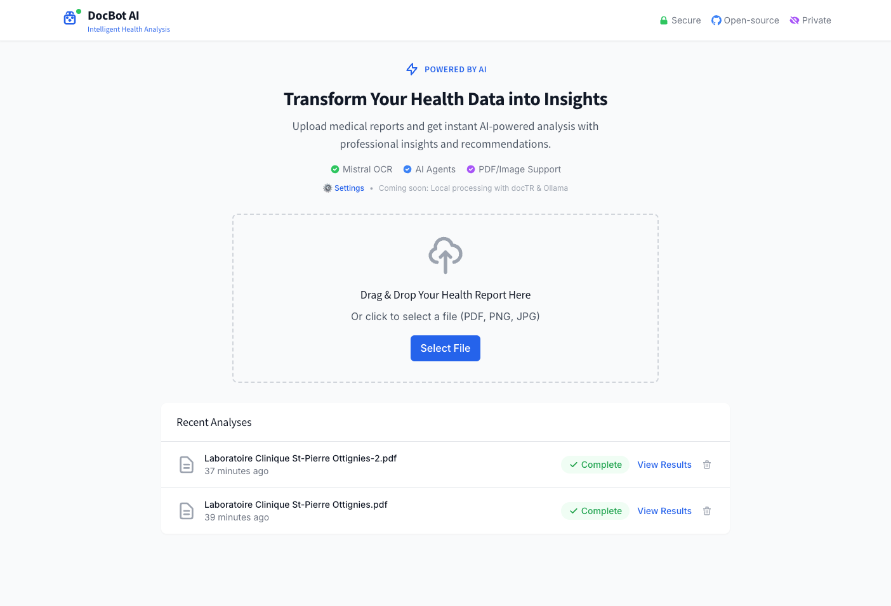
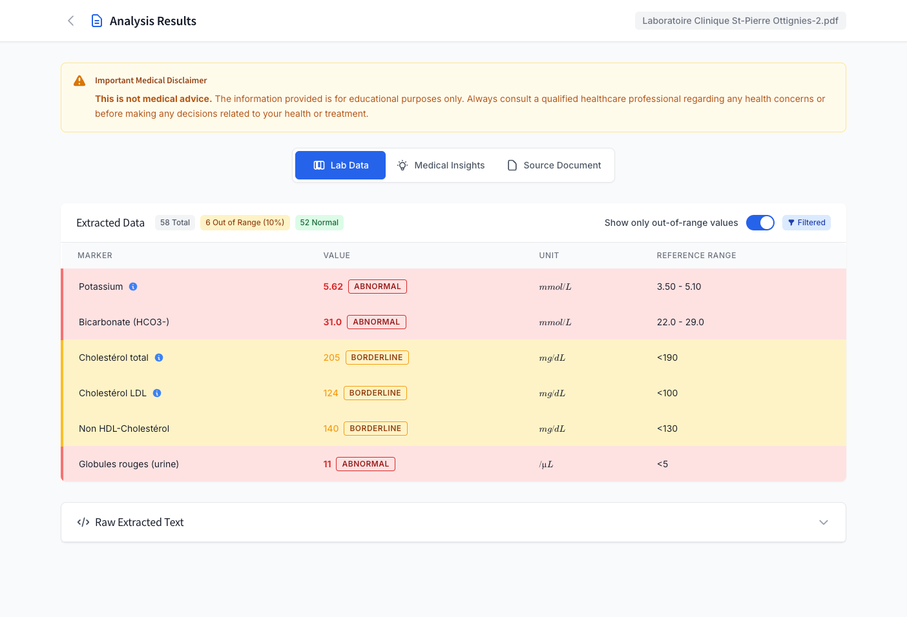
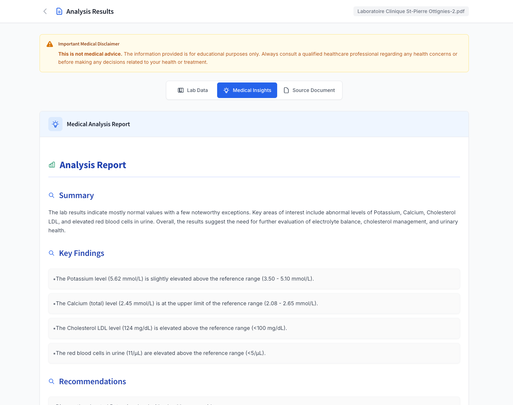

# DocBot AI – Health Document Analyzer

> ⚠️ **Important Notice**
>
> This repository is a proof-of-concept, initiated in July 2025 as part of a job interview preparation process. The codebase is under active development and may contain incomplete features or vulnerabilities. It is not intended for production or medical use.

This project is a full-stack application designed to analyze medical lab documents. It demonstrates a modern software architecture using Angular, FastAPI, and a specialized agent-based backend system to process and interpret health data.

## Table of Contents

1. [Features](#1-features)
2. [Preview](#2-preview)
3. [Architecture Overview](#3-architecture-overview)
4. [Tech Stack](#4-tech-stack)
5. [Testing Strategy](#5-testing-strategy)
6. [Development Scripts](#6-development-scripts)
7. [Local Development](#7-local-development)
8. [Roadmap](#8-roadmap)
9. [License](#9-license)

## 1. Features

*   **Secure Document Upload**: Upload PDF or image files of lab reports via drag-and-drop.
*   **Automated Data Extraction**: Uses OCR and AI to parse text and identify markers, values, and reference ranges.
*   **Out-of-Range Highlighting**: Automatically flags lab values that fall outside standard ranges for quick review.
*   **AI-Generated Insights**: Provides clear, human-readable summaries and interpretations of the lab data.
*   **Integrated Document Viewer**: Allows for easy cross-referencing between the extracted data and the original document.
*   **Persistent Analysis History**: View, manage, and re-process previously analyzed documents.
*   **Real-Time Processing Updates**: The UI reflects the document's analysis status in real time using Server-Sent Events (SSE).

## 2. Preview

Here's a visual overview of the application's key features:

### 2.1 Document Upload & Dashboard

*The main dashboard with drag-and-drop document upload functionality. Users can upload PDF or image files of medical lab reports and view their analysis history.*

### 2.2 Lab Data Analysis Results

*Structured extraction of lab values with automatic highlighting of out-of-range results. The interface shows extracted markers, values, units, and reference ranges in an easy-to-read format.*

### 2.3 AI-Generated Medical Insights

*AI-powered analysis providing summaries, key findings, and recommendations based on the extracted lab data. The insights tab offers human-readable interpretations of the medical data.*

## 3. Architecture Overview

The application is built on a decoupled architecture, separating the frontend, backend, and data services with specialized components for different processing stages.

### 3.1 High-Level Diagram
```
┌─────────────────────────┐      ┌───────────────────────────┐      ┌─────────────────────────┐
│   Angular 19 Frontend   │◄───► │      FastAPI Backend      │      │     Supabase Platform   │
│ (Signals, OnPush, SSE)  │      │   (Specialized Agents)    │      │  (Postgres & Storage)   │
├─────────────────────────┤      ├───────────────────────────┤      ├─────────────────────────┤
│ - Document Upload       │      │ - DocumentProcessor       │      │ - Document Records      │
│ - Real-Time Dashboard   │      │ - ProcessingPipeline      │      │ - Analysis Results      │
│ - Analysis Results View │      │ - ExtractionAgent         │      │ - Stored PDF/Image Files│
│                         │      │ - InsightAgent            │      │                         │
└─────────────────────────┘      └────────────┬──────────────┘      └─────────────────────────┘
                                              │
                                              ▼
                               ┌───────────────────────────┐
                               │    AI & OCR Services      │
                               │ (Mistral OCR, Chutes.AI)  │
                               └───────────────────────────┘
```


### 3.2 Frontend (Angular 19)

The frontend is developed using Angular 19, leveraging recent framework features to support a modular and maintainable architecture.

#### **Angular 19 Architecture**

* **Signals-Based State Management**: Uses Angular signals instead of RxJS Observables to manage reactive application state and data flow, in line with Angular’s current reactive paradigm.
* **Optimized Change Detection**: Uses the `OnPush` strategy together with signal-based inputs to reduce unnecessary component re-renders.
* **Modern Control Flow Syntax**: Applies the updated template syntax introduced in Angular 17+ (`@if`, `@for`), replacing legacy structural directives.

#### **Three-Layered Service Architecture**

Frontend services are structured into distinct layers to promote clear separation of concerns:

* **DocumentApiService**: Handles all REST API communication.
* **DocumentStore**: Manages centralized application state using Angular signals.
* **DocumentAnalysisService**: Coordinates business logic between the API layer and the state store.

#### **Key Frontend Features**

* **PDF Viewer Integration**: Three-panel layout (data table, AI insights, source document) implemented with `ng2-pdf-viewer` to support document review.
* **LaTeX Rendering Support**: `MathFormulaComponent` detects and renders LaTeX or plain text, with basic handling for formatting anomalies.
* **Real-Time Updates via SSE**: Uses Server-Sent Events to receive live updates, including error recovery and automatic reconnection.
* **Progress Tracking Interface**: Four-stage visual tracker (OCR → AI Analysis → Saving → Complete) with animated and color-coded indicators.
* **Clinical Data Display**: Displays lab marker information via `LabMarkerInfoService`, including reference ranges and contextual metadata.

### 3.3 Backend (Python / FastAPI)
The Python backend uses FastAPI for its asynchronous capabilities and implements a specialized agent architecture with clear separation of concerns:

- **DocumentProcessor**: Main orchestrator for the document processing workflow
- **StorageManager**: Handles all file storage operations with Supabase storage
- **DatabaseManager**: Manages all database operations including CRUD and analysis persistence
- **ProcessingPipeline**: Coordinates OCR extraction and AI analysis with progress tracking
- **ExtractionAgent**: Specialized agent for structured health data extraction using Chutes.AI
- **InsightAgent**: Dedicated agent for generating medical insights and recommendations

### 3.4 Data & Persistence (Supabase)
Supabase provides the PostgreSQL database and file storage. Schema changes are managed through version-controlled SQL migrations located in the `supabase/migrations` directory.

## 4. Tech Stack

| Layer       | Technology                                                              |
|-------------|-------------------------------------------------------------------------|
| **Frontend**  | Angular 19, TypeScript, Tailwind CSS, Signals, ng2-pdf-viewer |
| **Backend**   | Python 3.11, FastAPI, Pydantic, httpx, Specialized Agent Architecture  |
| **AI / ML**   | Mistral AI (OCR), Chutes.AI (Analysis), Structured Health Data Models  |
| **Database**  | Supabase (PostgreSQL)                                                   |
| **Storage**   | Supabase Storage                                                        |
| **DevOps**    | Docker, Docker Compose, GitHub Actions, Node 20                        |

## 5. Testing Strategy
A comprehensive, multi-layered testing strategy ensures high confidence in the application's stability, from individual functions to complete user flows.

| Layer | Goal | Tools | Coverage & Examples |
| :--- | :--- | :--- | :--- |
| **Backend Unit Tests** | Validate core backend processing logic and agent behavior. | **pytest** with async support | **DocumentProcessor Tests:** Complete document lifecycle testing including upload, processing pipeline coordination, and deletion with retry logic. <br><br>**Service Tests:** JSON utilities, OCR service functionality, and database operations with comprehensive mocking. <br><br>**Agent Integration:** Validation of the specialized extraction and insight agents. |
| **Frontend Unit Tests** | Validate individual units of code and UI components in isolation. | **Jasmine & Karma** | **Services (`DocumentAnalysisService`):** Testing the core business logic, including the entire document lifecycle (upload, SSE updates, deletion) using HttpClientTestingModule for mocking API calls. <br><br>**Components (`DataTableComponent`) :** Validating complex UI logic, such as the dynamic CSS class binding for highlighting out-of-range lab values, and testing signal-based inputs. |
| **End-to-End (E2E) Tests** | Validate critical user flows from the user's perspective across the entire frontend application. | **Cypress** | **Happy Path Testing:** Simulating the full user journey from file upload, observing real-time processing status on the dashboard, to navigating to the final analysis page. The backend is mocked using Cypress intercepts to provide consistent API responses, allowing the frontend to be tested in isolation. <br><br>**Edge Cases:** Empty state handling and error scenarios. |
| **Docker Integration Tests** | Validate the complete system in a containerized environment. | **Docker Compose** | **Service Integration:** Testing the interaction between all services in a production-like environment including database migrations and service connectivity. |
| **Continuous Integration** | Automate quality assurance and prevent regressions. | **GitHub Actions** | **Automated Pipeline:** On every push to `main`, runs linting (`ESLint`), all unit tests (frontend and backend), E2E tests, and production build validation (`ng build`) to catch Ahead-of-Time (AOT) compilation errors. |

### 5.1 Running Tests
```bash
# Backend Tests
cd backend
pip install -r requirements.txt
pytest

# Frontend Unit Tests
npm test

# E2E Tests  
npm run e2e:open              # Interactive mode
npm run e2e                   # Headless mode

# Complete Test Suite in Docker
npm run test:all:docker

# Individual Test Types
npm run test:docker           # Frontend unit tests in Docker
npm run e2e:docker           # E2E tests in Docker

# Coverage Reports
npm run test:coverage        # Frontend test coverage

# Project Validation
npm run dev:validate         # Validate project setup
npm run docker:test          # Test Docker builds and connectivity
```

## 6. Development Scripts

This project includes various utility scripts in the `scripts/` directory for development, testing, and maintenance:

```bash
# Development Environment
npm run dev:start            # Start development with automatic cleanup
npm run dev:validate         # Validate project setup and dependencies  
npm run dev:check-deps       # Check for dependency conflicts
npm run dev:fix-deps         # Fix npm dependency issues

# Docker Management
npm run docker:clean         # Clean up Docker resources
npm run docker:monitor       # Monitor Docker resource usage
npm run docker:test          # Test Docker builds and connectivity

# Testing
npm run test                 # Frontend unit tests
npm run test:docker          # Frontend tests in Docker
npm run e2e                  # E2E tests headless
npm run e2e:open             # E2E tests interactive
npm run test:all:docker      # Complete test suite
```

See `scripts/README.md` for detailed information about each script.

## 7. Local Development
Follow these steps to run the application on your local machine.

### 7.1 Prerequisites
*   Docker & Docker Compose
*   A Supabase account
*   API keys for **Mistral AI** and **Chutes.AI**

### 7.2 Configure Environment
Create a `.env` file in the `backend/` directory by copying the example file:
```bash
cp backend/.env.example backend/.env
```
Edit `backend/.env` and add your credentials:
```ini
# backend/.env
MISTRAL_API_KEY=your_mistral_api_key
CHUTES_AI_API_KEY=your_chutes_ai_key
SUPABASE_URL=your_supabase_project_url
SUPABASE_KEY=your_supabase_service_role_key
SUPABASE_BUCKET_NAME=health-docs # or your chosen bucket name
```
*Note: You will also need to set up the database schema using the files in `supabase/migrations`.*

### 7.3 Fix Dependencies (if needed)
If you encounter Docker dependency issues, run the fix script:
```bash
./scripts/fix-dependencies.sh
# or
npm run dev:fix-deps
```

### 7.4 Launch
With Docker running, start the services using Docker Compose:
```bash
docker-compose up --build
```
The application will be accessible at the following endpoints:
*   **Frontend UI**: `http://localhost:4200`
*   **Backend API Docs**: `http://localhost:8000/docs` (Swagger UI)

## 8. Roadmap
The following roadmap outlines areas for future exploration, focusing on applying advanced architectural patterns and strengthening the system's robustness and scalability.

### 8.1 Architecture & Refactoring
*   **Evolve to Hexagonal Architecture:** Formally refactor the backend by defining clear "Ports" (the application's core use cases) and "Adapters" (for external technologies like Supabase or Mistral). This would further decouple the core domain logic from infrastructure concerns.
*   **Introduce Domain-Driven Design (DDD) Concepts:** Clarify the "Bounded Contexts" within the application (e.g., `DocumentIngestion` vs. `AnalysisInterpretation`). Define Aggregates (like a `Document` with its `AnalysisResult`) and Value Objects to create a more expressive and resilient domain model.

### 8.2 Frontend Modernization & DX
*   **Full Signal Adoption:** Complete the migration from RxJS-based patterns to a fully signal-based architecture for state management and component communication, creating a more modern and unified codebase.
*   **Enhanced Testing Framework:** Consider migrating from Karma/Jasmine to **Jest** for improved performance, better mocking capabilities, and enhanced developer experience.

### 8.3 Backend & Scalability
*   **Integrate Local, Privacy-Focused Agents:** Implement alternative agents using on-device models like **`docTR`** for OCR and **`Ollama`** for LLM analysis, offering users a fully offline and private processing option.
*   **Decouple with Message Queue:** Replace direct `DocumentProcessor` calls with a message queue (e.g., RabbitMQ, Redis Streams) for improved fault tolerance and scalability.
*   **Implement Caching Layer:** Add Redis-based caching for external AI service calls to reduce latency and costs.

### 8.4 Security & Observability
*   **Implement Authentication:** Integrate full authentication system (e.g., Supabase Auth) with Row-Level Security (RLS) for data privacy.
*   **Enhanced Monitoring:** Implement structured logging and observability platform integration (e.g., Prometheus/Grafana) for performance tracking and system health monitoring.

## 9. License
This project is for personal, non-commercial use only. Please see the [LICENSE.md](LICENSE.md) file for more details.
