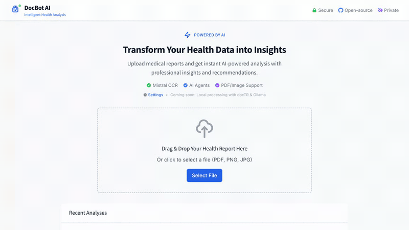
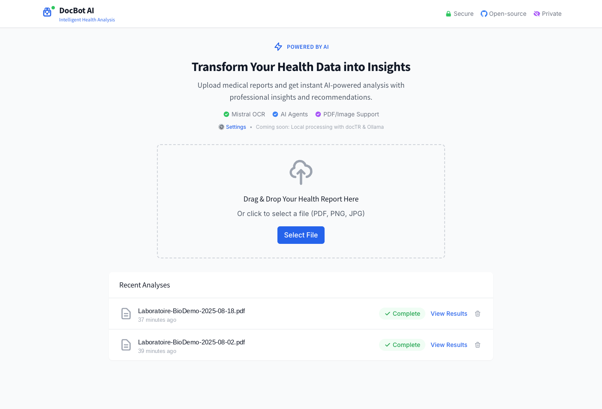
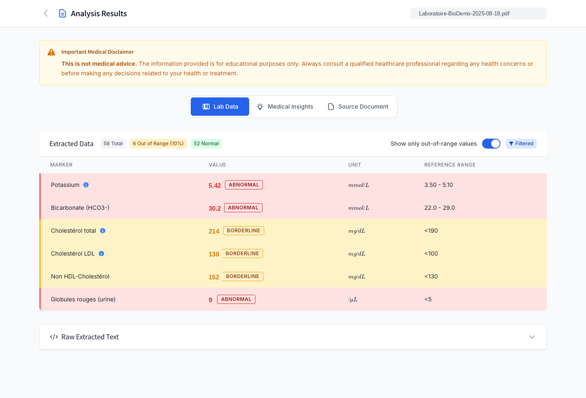
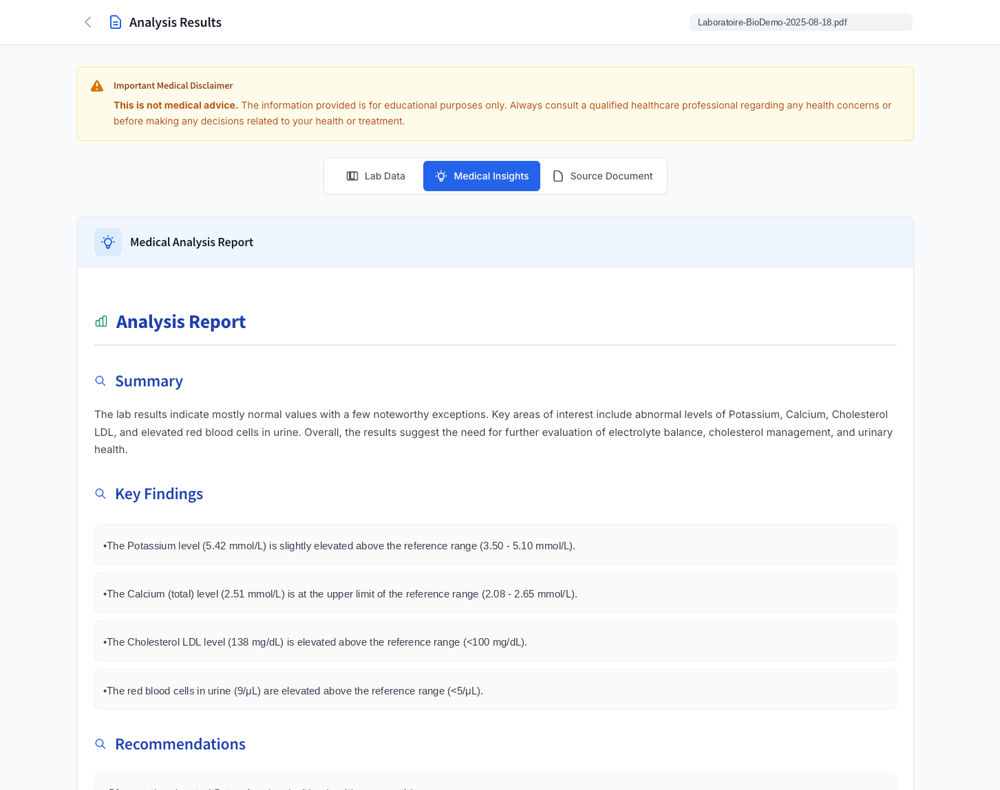
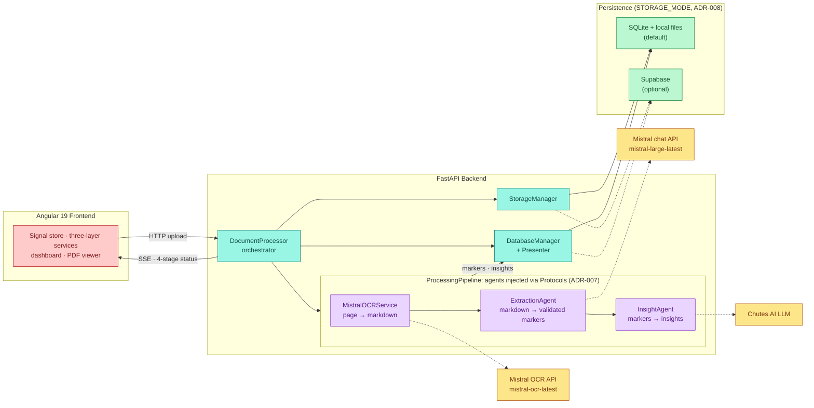
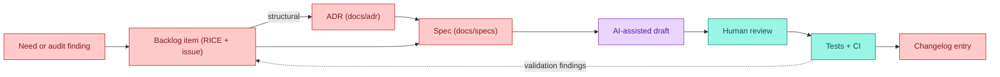

# DocBot AI: Health Document Analyzer

[](https://github.com/ggustin93/agentic-lab-analyzer/actions/workflows/ci.yml)
[](LICENSE.md)


This project is a full-stack application designed to analyze medical lab documents. It demonstrates a modern software architecture using Angular, FastAPI, and a specialized agent-based backend system to process and interpret health data. The engineering process is documented as first-class output: [ADRs](docs/adr/), a [specified backlog](docs/backlog/), [feature specs](docs/specs/), and the [AI-assisted workflow and its guardrails](docs/ai-workflow.md).

> **Proof of concept** (July 2025 → ongoing). Not intended for production or medical use; the security scope is stated openly in [Section 8](#8-security-privacy--known-limitations).

## Table of Contents

1. [Features](#1-features)
2. [Preview](#2-preview)
3. [Architecture Overview](#3-architecture-overview)
4. [Tech Stack](#4-tech-stack)
5. [Testing Strategy](#5-testing-strategy)
6. [Development Scripts](#6-development-scripts)
7. [Local Development](#7-local-development)
8. [Security, Privacy & Known Limitations](#8-security-privacy--known-limitations)
9. [Roadmap](#9-roadmap)
10. [License](#10-license)

## 1. Features

*   **Document Upload**: Upload PDF or image files of lab reports via drag-and-drop.
*   **Automated Data Extraction**: Uses OCR and AI to parse text and identify markers, values, and reference ranges.
*   **Out-of-Range Highlighting**: Flags values outside the parsed reference range (LLM-assisted today; deterministic backend flagging is [backlog 007](docs/backlog/007-deterministic-out-of-range.md)).
*   **AI-Generated Insights**: Provides clear, human-readable summaries and interpretations of the lab data.
*   **Integrated Document Viewer**: Allows for easy cross-referencing between the extracted data and the original document.
*   **Persistent Analysis History**: View, delete, and re-process previously analyzed documents.
*   **Real-Time Processing Updates**: The UI reflects the document's analysis status in real time using Server-Sent Events (SSE).

## 2. Preview

A visual overview of the application's key features. All captures show synthetic lab data: no real documents are ever processed.


*End-to-end run: a synthetic lab report is uploaded, processed through the 4-stage pipeline, and reviewed (extracted markers, then AI insights).*

### 2.1 Document Upload & Dashboard

*The main dashboard with drag-and-drop document upload functionality. Users can upload PDF or image files of medical lab reports and view their analysis history.*

### 2.2 Lab Data Analysis Results

*Structured extraction of lab values with highlighting of out-of-range results: markers, values, units, and reference ranges.*

### 2.3 AI-Generated Medical Insights

*Summaries, key findings, and recommendations generated from the extracted data.*

## 3. Architecture Overview

DocBot AI is a multi-tier system: an Angular frontend, a FastAPI backend, and a pipeline of specialized AI agents. **How it works, in five steps:**

1. **OCR extraction**: `MistralOCRService` turns the uploaded PDF/image into per-page markdown, preserving table structure.
2. **Structured extraction**: `ExtractionAgent` (Mistral Large) parses that markdown into typed health markers, validated with Pydantic; behavior, business rules and edge cases are specified in [docs/specs/lab-marker-extraction.md](docs/specs/lab-marker-extraction.md).
3. **Insight generation**: `InsightAgent` (Chutes.AI) produces a summary and recommendations from the *validated* structured data; the medical disclaimer is enforced server-side.
4. **Persistence**: results are stored in Supabase PostgreSQL through version-controlled migrations.
5. **Real-time updates**: Server-Sent Events stream the four processing stages to the Angular frontend, whose state lives in signals.

### 3.1 High-Level Diagram


```mermaid
flowchart LR
    subgraph Frontend["Angular 19 Frontend"]
        UI["Signal store · three-layer services<br/>dashboard · PDF viewer"]
    end
    subgraph Backend["FastAPI Backend"]
        DP["DocumentProcessor<br/>orchestrator"]
        SM["StorageManager"]
        DM["DatabaseManager<br/>+ Presenter"]
        subgraph PP["ProcessingPipeline: agents injected via Protocols (ADR-007)"]
            OCR["MistralOCRService<br/>page → markdown"] --> EXT["ExtractionAgent<br/>markdown → validated markers"] --> INS["InsightAgent<br/>markers → insights"]
        end
    end
    subgraph Persistence["Persistence (STORAGE_MODE, ADR-008)"]
        DB["SQLite + local files<br/>(default)"]
        ST["Supabase<br/>(optional)"]
    end
    UI -- "HTTP upload" --> DP
    DP -- "SSE · 4-stage status" --> UI
    DP --> SM
    DP --> DM
    DP --> PP
    PP -- "markers · insights" --> DM
    SM --> DB
    DM --> DB
    SM -.-> ST
    DM -.-> ST
    OCR -.-> M1["Mistral OCR API<br/>mistral-ocr-latest"]
    EXT -.-> M2["Mistral chat API<br/>mistral-large-latest"]
    INS -.-> M3["Chutes.AI LLM"]

    classDef frontend fill:#fecaca,stroke:#b91c1c,color:#7f1d1d
    classDef backend fill:#99f6e4,stroke:#0f766e,color:#134e4a
    classDef agents fill:#e9d5ff,stroke:#7e22ce,color:#581c87
    classDef external fill:#fde68a,stroke:#b45309,color:#78350f
    classDef data fill:#bbf7d0,stroke:#15803d,color:#14532d

    class UI frontend
    class DP,SM,DM backend
    class OCR,EXT,INS agents
    class M1,M2,M3 external
    class DB,ST data
```

Architecture decisions and their trade-offs are recorded as ADRs in [`docs/adr/`](docs/adr/); the AI-assisted development workflow behind this project is documented in [`docs/ai-workflow.md`](docs/ai-workflow.md).

### 3.2 Repository Map & Delivery Pipeline

These artifacts are not decoration; they are the pipeline every change goes through:


```mermaid
flowchart LR
    A["Need or audit finding"] --> B["Backlog item (RICE + issue)"]
    B -->|structural| C["ADR (docs/adr)"]
    C --> D["Spec (docs/specs)"]
    B --> D
    D --> E["AI-assisted draft"]
    E --> F["Human review"]
    F --> G["Tests + CI"]
    G --> H["Changelog entry"]
    G -.->|validation findings| B

    classDef product fill:#fecaca,stroke:#b91c1c,color:#7f1d1d
    classDef ai fill:#e9d5ff,stroke:#7e22ce,color:#581c87
    classDef eng fill:#99f6e4,stroke:#0f766e,color:#134e4a
    class A,B,C,D,H product
    class E ai
    class F,G eng
```

A high-level map; the detailed structure and per-file notes live in [`CLAUDE.md`](CLAUDE.md):

| Path | Contents |
|---|---|
| `src/app/` | Angular 19 frontend: components, three-layer services (API / signal store / orchestration), clinical marker data |
| `backend/` | FastAPI app, agents behind Protocol contracts, services (pipeline, persistence, presenter), pytest suite |
| `supabase/migrations/` | Version-controlled schema, each migration with its rollback |
| `docs/adr/` | Architecture Decision Records ([index](docs/adr/README.md)) |
| `docs/backlog/` | Specified backlog with acceptance criteria, mirrored as GitHub issues ([index](docs/backlog/README.md)) |
| `docs/specs/` | Feature specifications: behavior, business rules, edge cases, validation intent ([lab marker extraction](docs/specs/lab-marker-extraction.md)) |
| `docs/` | [AI workflow](docs/ai-workflow.md), [Docker guide](docs/docker.md), [research notes](docs/research-notes.md) |
| `CHANGELOG.md` | [Version history](CHANGELOG.md) by phase |

### 3.3 Frontend (Angular 19)

Modern Angular patterns applied end to end: signals for state (no NgRx; rationale in [ADR-001](docs/adr/001-angular-signals-over-rxjs-state.md)), `OnPush` change detection, `@if/@for` control flow, `inject()`, standalone components. The service layer is deliberately three-tiered:

* **`DocumentApiService`**: HTTP only, no state
* **`DocumentStore`**: signal-based state, computed selectors, immutable updates
* **`DocumentAnalysisService`**: orchestration: upload lifecycle, one SSE connection per in-flight document, deletion and retry flows

Domain services (`ReferenceRangeParserService`, `LabMarkerInfoService`) keep clinical logic out of components.

### 3.4 Backend (Python / FastAPI)
The Python backend uses FastAPI for its asynchronous capabilities and implements a specialized agent architecture with clear separation of concerns:

- **DocumentProcessor**: Main orchestrator for the document processing workflow
- **StorageManager**: File storage behind the `FileStorage` port; local uploads folder by default, Supabase Storage optional (ADR-008)
- **DatabaseManager**: Manages all database operations including CRUD and analysis persistence
- **ProcessingPipeline**: Coordinates OCR extraction and AI analysis with progress tracking
- **ExtractionAgent**: Structured health data extraction (Mistral Large)
- **InsightAgent**: Dedicated agent for generating medical insights and recommendations

Agents are injected against the Protocol contracts in `agents/base.py`, so implementations are swappable and tests use plain fakes ([ADR-007](docs/adr/007-hexagonal-lite.md)).

### 3.5 Data & Persistence (local by default, Supabase optional)
Persistence sits behind two `Protocol` ports (`backend/services/ports.py`), selected by `STORAGE_MODE` ([ADR-008](docs/adr/008-local-first-persistence.md)):

* **`local` (default)**: SQLite + a local uploads folder served over HTTP. No cloud account needed; clone, add two AI keys, run.
* **`supabase`**: PostgreSQL and file storage, with version-controlled SQL migrations (each with a rollback) in `supabase/migrations/`; trade-offs in [ADR-005](docs/adr/005-supabase-as-backend-platform.md).

## 4. Tech Stack

| Layer       | Technology                                                              |
|-------------|-------------------------------------------------------------------------|
| **Frontend**  | Angular 19, TypeScript, Tailwind CSS, Signals, ng2-pdf-viewer |
| **Backend**   | Python 3.11, FastAPI, Pydantic, httpx, Specialized Agent Architecture  |
| **AI / ML**   | Mistral AI (OCR), Chutes.AI (Analysis), Structured Health Data Models  |
| **Database**  | SQLite (default) / Supabase PostgreSQL (optional, ADR-008)             |
| **Storage**   | Local filesystem (default) / Supabase Storage (optional)                |
| **DevOps**    | Docker, Docker Compose, GitHub Actions, Node 20                        |

## 5. Testing Strategy

> **Scope:** testing follows an 80/20 strategy; the critical user journeys are covered (see 5.1), exhaustive coverage is not the goal for a proof-of-concept. Known gaps are tracked in the [backlog](docs/backlog/013-test-coverage-gaps.md).

### 5.1 What is tested today

- **Frontend, 22 unit tests** (Jasmine/Karma, randomized order): the full upload lifecycle with a mocked HTTP layer and no state pollution on errors; clinical value-status logic in `DataTableComponent` (normal / high / low / boundary and malformed ranges); toast service behavior.
- **Backend, 49 tests** (pytest; `tests/conftest.py` injects dummy config, so no secret is needed): processor lifecycle with retry logic, API-level upload validation and bounded SSE (via `TestClient` + `dependency_overrides`), the async OCR service, ISO date validation, presenter pure functions, and contract tests running the local persistence adapters against a real SQLite database (ADR-008).
- **E2E, Cypress** (local/Docker, not yet in CI): the happy path with a mocked API, and the empty state.
- **Not yet covered** (tracked in [#10](https://github.com/ggustin93/agentic-lab-analyzer/issues/10)): `reference-range-parser.service.ts`, the signal store, SSE message handling, coverage measurement in CI.

### 5.2 Layers & tooling

| Layer | Tooling | Scope |
| :--- | :--- | :--- |
| Backend unit/API | pytest + `TestClient` | Pipeline, validation, SSE bounds, all against mocks |
| Frontend unit | Jasmine/Karma | Services and component logic, `HttpClientTestingModule` |
| E2E | Cypress (+ Docker) | User journeys against a mocked API |
| CI | GitHub Actions | Lint, frontend + backend unit tests, production AOT build on every push |

### 5.3 Running tests

```bash
cd backend && pytest        # backend (no secrets needed)
npm test                    # frontend unit tests
npm run e2e                 # Cypress, headless
npm run test:all:docker     # everything, containerized
```

## 6. Development Scripts

Utility scripts for development, Docker management and dependency fixes live in [`scripts/`](scripts/) and are exposed as npm scripts; see [`scripts/README.md`](scripts/README.md) for the full catalog.

## 7. Local Development
Follow these steps to run the application on your local machine.

### 7.1 Prerequisites
*   Docker & Docker Compose
*   API keys for **Mistral AI** and **Chutes.AI**

That's all: persistence defaults to local SQLite + a local uploads folder ([ADR-008](docs/adr/008-local-first-persistence.md)), no database account needed.

### 7.2 Configure Environment
Create a `.env` file in the `backend/` directory by copying the example file:
```bash
cp backend/.env.example backend/.env
```
Edit `backend/.env` and add your two keys:
```ini
# backend/.env
MISTRAL_API_KEY=your_mistral_api_key
CHUTES_AI_API_KEY=your_chutes_ai_key
```
Local data lands in `backend/data/` (SQLite) and `backend/uploads/` (files), both gitignored.

<details>
<summary>Optional: Supabase mode</summary>

```ini
STORAGE_MODE=supabase
SUPABASE_URL=your_supabase_project_url
SUPABASE_KEY=your_supabase_service_role_key  # trusted backend only; never expose this key client-side (bypasses RLS)
SUPABASE_BUCKET_NAME=health-docs
```
Set up the database schema with the files in `supabase/migrations/`.
</details>

### 7.3 Launch
With Docker running, start the services using Docker Compose:
```bash
docker-compose up --build
```
The application will be accessible at the following endpoints:
*   **Frontend UI**: `http://localhost:4200`
*   **Backend API Docs**: `http://localhost:8000/docs` (Swagger UI)

## 8. Security, Privacy & Known Limitations

This is a proof-of-concept and its security posture is stated openly rather
than implied. The list below is the project's own threat-model summary; each
item is a conscious scope decision with a planned remediation, not an
oversight. Architecture decisions (and their accepted trade-offs) are
recorded as ADRs in [`docs/adr/`](docs/adr/).

### 8.1 Intended use

DocBot AI is an **educational tool for exploring AI-assisted document
analysis**, not a medical device, and not a substitute for professional
advice. Every AI output carries a server-enforced disclaimer, and the demo
only ever processes synthetic documents.

### 8.2 Known security limitations (deliberate PoC scope)

| # | Limitation | Risk | Planned remediation |
|---|------------|------|---------------------|
| 1 | **No authentication** on API endpoints | Anyone reaching the API can list/read/delete all documents | Supabase Auth (JWT) + per-user scoping on every query |
| 2 | **Public storage bucket** with permanent URLs *(Supabase mode)* | Documents readable by anyone with the link | Private bucket + short-lived signed URLs |
| 3 | **No Row Level Security** in the database *(Supabase mode)* | Tables reachable via Supabase REST with the anon key | RLS policies per `user_id` on all tables and `storage.objects` (see ADR-005) |
| 4 | **No rate limiting** | Anonymous uploads/retries trigger paid LLM calls | Rate limiting + per-document processing lock |

These are acceptable **only** because the project runs locally with synthetic
data. Items 1–3 are the prerequisite to any deployment. Each limitation is
specified with acceptance criteria in [`docs/backlog/`](docs/backlog/), and
open research questions about the AI core (evaluation methodology,
robustness, calibration) are collected in
[`docs/research-notes.md`](docs/research-notes.md).

### 8.3 AI safety measures already in place

- The medical **disclaimer is enforced server-side**; it never depends on
  the model including it.
- **Ambiguous dates are rejected, not guessed**: extraction requires ISO 8601
  and non-conforming dates become `null` (a silently swapped day/month on a
  Belgian lab report is a data-integrity error, not a formatting detail).
- Document-derived text is treated as **untrusted input** end to end; AI
  outputs are shape-validated with Pydantic before persistence.
- Uploads are **validated server-side** (bounded size, magic-bytes content
  type; a rejected file leaves no trace), SSE streams are bounded (404 on
  unknown ids, lifetime cap, disconnect detection), and client-facing error
  messages are generic: exception details stay in server logs.
- The AI-assisted development process itself has guardrails, documented in
  [`docs/ai-workflow.md`](docs/ai-workflow.md).

## 9. Roadmap

The roadmap **is** the backlog: every planned item is specified with context,
acceptance criteria and priority in [`docs/backlog/`](docs/backlog/README.md)
and mirrored as [GitHub issues](https://github.com/ggustin93/agentic-lab-analyzer/issues).
The current priorities, in order:

1. **Trust the deployment**: authentication, RLS and private storage, rate limiting (backlog 003–005): the prerequisites to running anywhere but locally.
2. **Trust the AI**: a prompt evaluation harness over a synthetic lab-report corpus (011, 018), deterministic out-of-range flagging (007), analysis provenance (010).
3. **Own the infrastructure**: local OCR/LLM adapters (Docling, Ollama) for a fully offline, privacy-preserving mode (017).

## 10. License

[MIT](LICENSE.md). The intended-use boundary in section 8.1 still applies:
this is an educational proof-of-concept, not a medical device.
