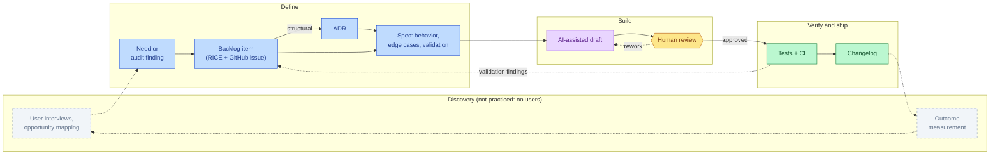

# AI-assisted development workflow

This project is built AI-first, deliberately: AI agents draft, a human decides.
This document describes the actual workflow, its guardrails, and what stays
human: because "we use AI" only means something if you can say *how* and
*where its output gets challenged*.

How a need becomes shipped software in this repository:

Known limitation of this pipeline: it is single-track by necessity. The
dashed discovery track is shown but not practiced: a solo proof of concept
has no users to interview and no outcomes to measure, so the feedback loop
closes on technical validation instead. A real product would activate that
track; what runs today is the delivery half of a dual-track model.

## Where AI is used

| Activity | AI role | Human role |
|----------|---------|------------|
| Feature scaffolding | Draft components, services, tests | Review architecture fit, trim generated verbosity |
| Specification | Explore edge cases, draft acceptance criteria | Decide scope, priorities, what is *out* of scope |
| Code review | Adversarial review passes (security, quality) over the diff | Verify each finding against the code before acting |
| Documentation | First drafts of docs and ADRs | Own the decisions; ADRs record human trade-offs |
| Repo audits | Multi-agent sweeps (security, testing/CI, architecture) | Triage findings, score them (RICE), accept/reject |

Project context for AI assistants lives in `CLAUDE.md` (architecture map,
commands, conventions). It is treated as documentation: when the code and
`CLAUDE.md` disagree, the file gets fixed; a stale claim is worse than no
claim.

## Guardrails

- **AI output is a proposal, never a merge.** Every generated change goes
  through human review with the same standard as third-party code.
- **Determinism over generation for safety-relevant logic.** The LLM extracts
  and summarizes; validation rules (dates must be ISO 8601 and are rejected
  rather than guessed, the medical disclaimer is enforced server-side) live
  in reviewed, tested code: see `backend/services/json_utils.py` and
  `insight_agent.py`.
- **No health data in AI development loops.** Real documents never serve as
  prompts or fixtures; test fixtures are synthetic
  (`cypress/fixtures/test.pdf` is a 30-byte dummy).
- **Generated noise is a defect.** Debug logging, dead effects, and
  tutorial-style comments left by generation sessions are treated as bugs
  (enforced e.g. by the `no-console` ESLint rule), because unreviewed AI
  output is indistinguishable from unowned code.

## In practice: this repo's own hardening pass

The repository was audited by parallel AI agents (security sweep, frontend &
CI review), and their findings were then human-triaged: scored with
RICE, mapped to a risk register, converted into acceptance criteria, and
applied selectively. The audit found real bugs (an SSE connection that broke
with two concurrent uploads, a JSON "cleaner" that could corrupt valid JSON,
a US date-pivot that could silently swap day and month on Belgian reports).
It also produced findings that were rejected after verification. That
accept/reject loop is the workflow this document describes.
