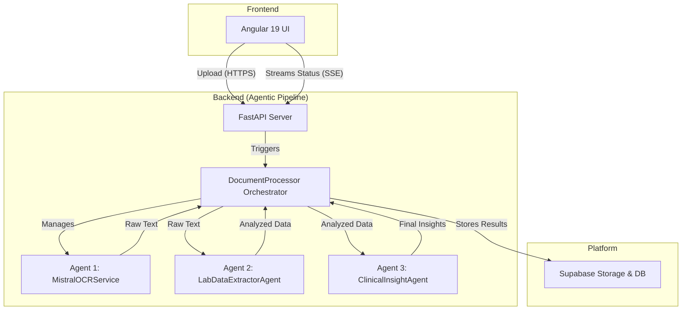

# System Design & Architectural Patterns

This document outlines the high-level architecture and key design patterns for the Lab Insight Engine.

## 1. System Architecture

The system is a decoupled, full-stack application composed of an Angular frontend, a FastAPI backend, and the Supabase platform for persistence.

## 2. Core Backend Patterns

### Multi-Agent Pipeline
The backend's core is a pipeline of specialized, independent agents.
-   **Separation of Concerns**: Each agent has a single responsibility (OCR, data extraction, insight generation), which enhances modularity and simplifies maintenance.
-   **Orchestration**: A `DocumentProcessor` class orchestrates the data flow between agents, but is decoupled from their specific implementations, enabling future modularity.
-   **Pipeline Stages**:
    1.  `MistralOCRService`: Performs OCR, returning raw text.
    2.  `LabDataExtractorAgent`: Extracts structured data from the text using an LLM, then analyzes this data using deterministic Python logic to assign a severity status.
    3.  `ClinicalInsightAgent`: Synthesizes the structured, analyzed data into human-readable insights using an LLM.

### Hybrid AI & Deterministic Logic
A hybrid approach ensures both intelligence and reliability.
-   **AI for Unstructured Tasks**: LLMs are leveraged for their strength in parsing and interpreting unstructured text.
-   **Python for Deterministic Logic**: Critical analysis, such as comparing a lab value to its reference range, is performed in pure Python to guarantee accuracy and eliminate the risk of AI-induced errors.

### Interface-Based Design
The system uses Python's `Protocol` to define contracts (interfaces) for its agents. The orchestrator depends on these protocols, not on concrete classes. This application of the Dependency Inversion Principle is fundamental to the system's flexibility and extensibility.
